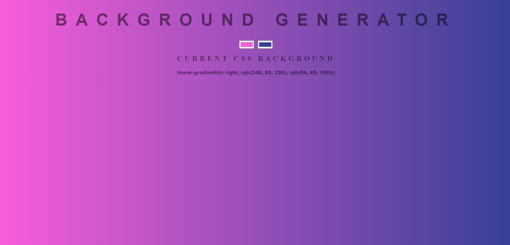

# Background Generator



The Background Generator is a tool designed to simplify the process of generating CSS background styles for web projects. With this handy utility, developers and designers can quickly experiment with various color combinations and gradients to create visually appealing backgrounds for their websites, web applications, or any other digital projects.

# Key Features

* **Color Palette**: The Background Generator provides an intuitive color picker that allows users to select custom colors or enter specific color codes. It enables users to experiment with background colors effortlessly and find the perfect match for their project's theme.

* **Gradient Creator**: Creating stunning gradients has never been easier. This tool offers a user-friendly interface for generating linear gradients with multiple color stops. Users can adjust the direction, angle, and colors to craft eye-catching gradient backgrounds.

* **Background Code Output**: As users fine-tune their background settings, the Background Generator instantly generates the corresponding CSS code. It provides a simple copy-to-clipboard feature, allowing developers to swiftly integrate the generated background styles into their projects.

* **Preview Pane**: The tool offers a live preview pane that allows users to see the changes in real-time as they adjust the color and gradient settings. This dynamic preview empowers users to make informed decisions about their background choices.

* **Responsive Design**: The Background Generator is designed to be responsive, ensuring it works seamlessly on various devices and screen sizes. Whether you're using a desktop computer, tablet, or smartphone, the tool's interface adapts accordingly for an optimal user experience.

# How to Use

1. **Select Colors**: Choose colors for your background using the color picker or input specific color codes.

2. **Create Gradients**: Utilize the gradient creator to craft captivating linear gradients with multiple color stops.

3. **Preview and Adjust**: Observe the live preview as you make changes. Tweak the colors and settings until you achieve the desired background effect.

4. **Copy CSS Code**: Once you're satisfied with the background design, copy the generated CSS code to your clipboard.

5. **Implement in Projects**: Easily integrate the CSS background styles into your website or web application by pasting the code in your project's stylesheet.

```bash
 git clone https://github.com/your-username/background_generator.git
```

```bash
cd background_generator
```

# Get Started

The Background Generator is a valuable tool for web developers and designers seeking to enhance the visual appeal of their projects. Say goodbye to the hassle of manually writing complex CSS background styles and enjoy the convenience of this user-friendly utility.

Visit the Background Generator website now to explore its features and streamline your background design process. Create visually stunning backgrounds effortlessly and elevate your projects to a whole new level!